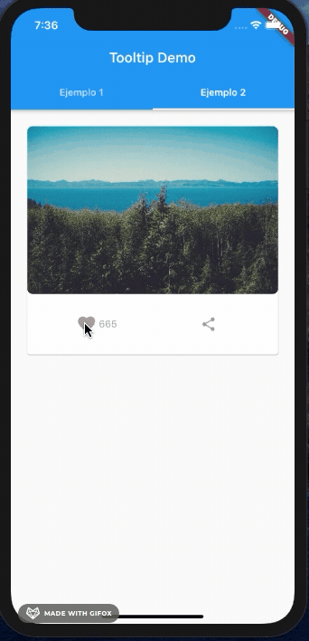
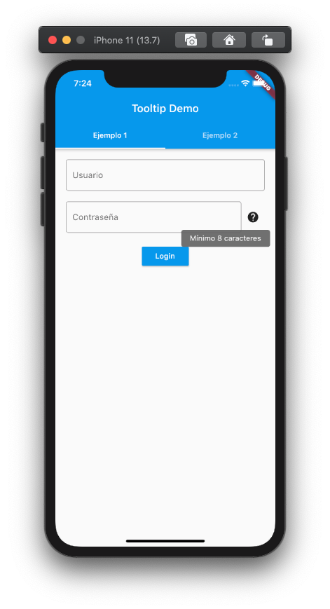
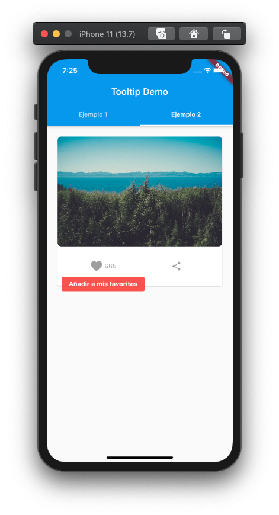
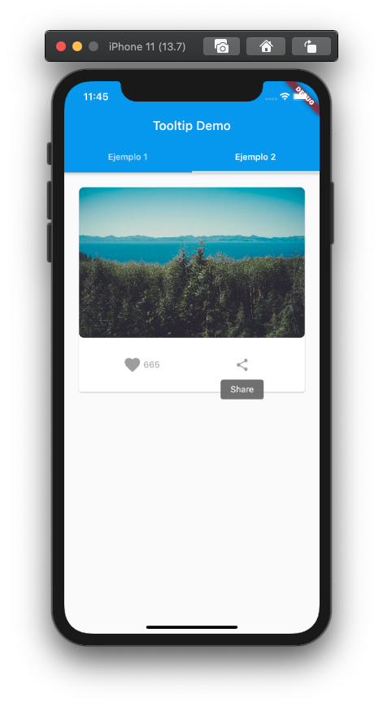

# Tooltip

## Introducción

El objetivo del proyecto de este repositorio es estudiar y explicar a nuestros compañeros de la asignatura **Nuevas tendencias en el desarrollo de aplicaciones móviles** del _Máster de Desarrollo de Aplicaciones para Dispositivos Móviles_ de la UOC un widget de [Flutter](https://flutter.dev) que nosotros hayamos elegido. En nuestro caso ese widget ha sido [Tooltip](https://api.flutter.dev/flutter/material/Tooltip-class.html).

## ¿Que es Tooltip?

Un tooltip es una herramienta de ayuda visual que al situar el cursor sobre un elemento (o al hacer una pulsación larga en un dispositivo móvil) explica la finalidad de dicho elemento.



## ¿Por que es interesante?

Hemos elegido este widget porque nos parece un complemento muy útil a la hora de ayudar al usuario a realizar la tarea de desea. Los dispositivos móviles tienen un espacio limitado para distribuir elementos (botones, textos...) y muchas veces no queda claro del todo cuál es la finalidad de cada elemento. Para evitar que el usuario dude y tenga que acudir a manuales de usuario, es buena idea añadir estas pequeñas ayudas (sin pasarse) para guiar y así hacer la interfaz gráfica 'amigable'.

## ¿Como se usa?

El uso de Tooltip en Flutter es bastante sencillo. Tan solo hay que incluir el widget sobre el que queremos informar como `children` dentro del widget `Tooltip` (como aparece en el código de abajo).

```dart
Tooltip(
    message: "El mensaje que queremos mostrar",
    child: nuestroWidget()
)
```

De esta manera, cuando mantengamos pulsado durante un tiempo el elemento que hemos puesto como `children`, nos aparecerá el texto que hemos marcado como `message`:

```dart
Row(
    children: [
        Flexible(
            child: TextField(
                obscureText: true,
                controller: passwordController,
                decoration: InputDecoration(
                    border: OutlineInputBorder(),
                    labelText: 'Contraseña',
                ),
            ),
        ),
        Tooltip(
            message: 'Mínimo 8 caracteres',
            child: Padding(
                padding: EdgeInsets.all(10),
                child: Icon(Icons.help),
            ),
        ),
    ],
)
```



El ejemplo de arriba es muy habitual en formularios de registros, para dar información sin tener que ocupar espacio en la pantalla.

La clase Tooltip es muy personalizable. Estos son algunos de los atributos que se pueden editar:

- **showDuration**: el tiempo que debe pasar para que se oculte el tooltip después de soltar la pulsación larga
- **decoration**: para editar la forma y el color del tooltip. Depende de la clase [Decoration](https://api.flutter.dev/flutter/painting/Decoration-class.html) y sus implementaciones
- **textStyle**: para editar el estilo del texto del mensaje (de la clase [TextStyle](https://api.flutter.dev/flutter/painting/TextStyle-class.html))
- **preferBelow**: si queremos que el tooltip se muestre por debajo del widget

```dart
Tooltip(
    decoration: BoxDecoration(
        color: Colors.red.withOpacity(0.9),
        borderRadius: const BorderRadius.all(Radius.circular(4),
        ),
    ),
    textStyle: TextStyle(
        color: Colors.white, fontWeight: FontWeight.bold),
        message: "Añadir a mis favoritos",
    child: LikeButton(
        likeCount: 665,
        onTap: onLikeButtonTapped,
    ),
)
```



Hay que mencionar que algunos elementos de Flutter como IconButton, FloatingActionButton, and PopupMenuButton incorporan un atributo Tooltip que cuando no es nulo crea un widget con la informacion establecida:

```dart
IconButton(
    icon: Icon(Icons.share),
    onPressed: null,
    tooltip: "Share",
)
```


